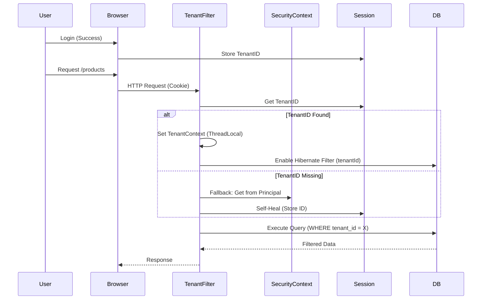
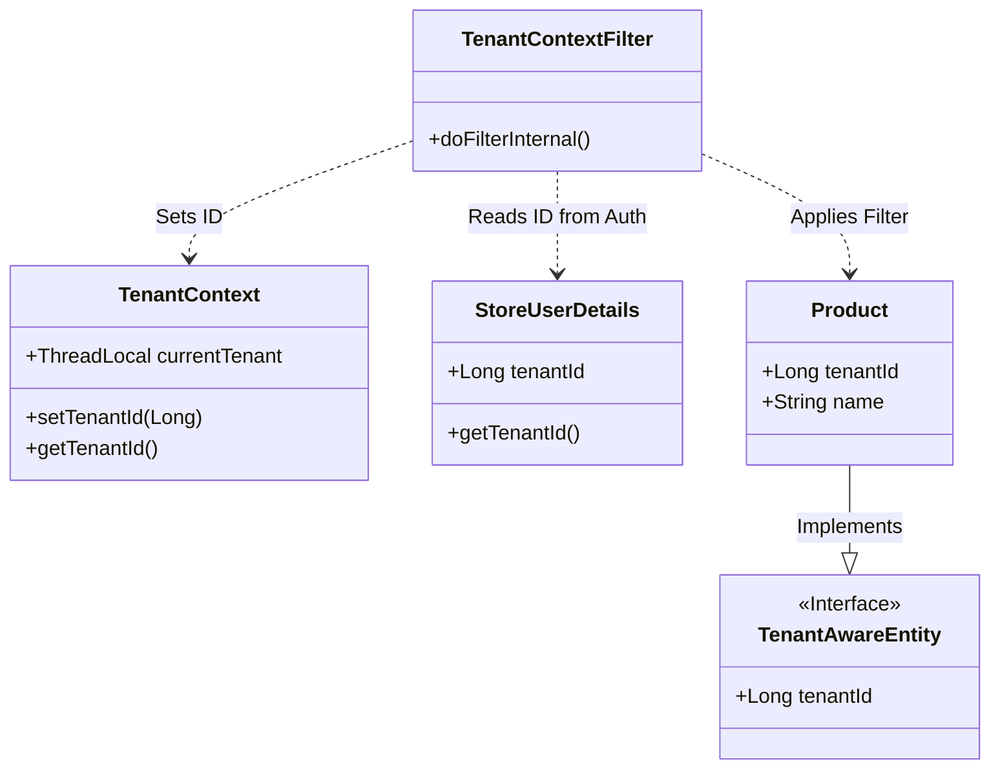

# AG-Project Manual & Business Guide
*Reference Number: AG-DOC-MAN-001*

## 1. Business Model & Plan
**Transformation Goal:** Turn a monolithic e-commerce app into a scalable Multi-Tenant SaaS Platform.

### Core Value Proposition
- **For Tenants (Shop Owners):** Enterprise-grade e-commerce features (Inventory, Sales, CRM) without technical overhead.
- **For Platform Protocol:** Secure data isolation, global observability, and centralized updates.

### Tenant Strategy
- **Isolation:** Data is isolated via `tenant_id` at the database level (Shared Database, Separate Schema per Tenant Logic).
- **Resolution:**
    1.  **Login:** User logs in -> `TenantId` fetched from `users` table -> Stored in `Session`.
    2.  **Request:** `TenantContextFilter` extracts ID from Session -> Sets `TenantContext` -> Enables Hibernate Filter.
    3.  **Query:** All queries automatically filter by `tenant_id`.

## 2. Architecture Overview & UML
- **Stack:** Spring Boot 3, Hibernate 6, Thymeleaf, MySQL.

### Tenant Filter Flow (Sequence Diagram)
How the system ensures every request is secure:

### Class Relationships (Multi-Tenancy)
How code components interact:

## 3. Marketing & Sales Intelligence (Future)
*Ref: AG-BIZ-INT-001*
- **Product Intelligence:** Track most viewed vs. most sold products per tenant.
- **Sales Intelligence:** Heatmaps of sales by region (using existing `Country`/`State` entities).
- **Campaigns:** Email marketing features (built on `emailSender` module).

## 4. Development Standards
*Ref: AG-DEV-STD-001*
- **Tracing:** All logs must include `[TenantID: X]`.
- **Docs:** Implementation Plans are mandatory for changes.
- **Testing:**
    - `*ManualTest`: Functional verification (Requires DB).
    - `*CheckTest`: Configuration verification.

## 5. Troubleshooting Guide (AG-TRBL-001)

### Common Issues
| Issue | Cause | Fix |
| :--- | :--- | :--- |
| **Email 530 STARTTLS** | Typo `STMP` vs `SMTP` in `application.properties` or code. | Use `SMTP` consistently. Enable `mail.smtp.starttls.enable`. |
| **Data Leak (Tenant)** | Filter running twice or Hibernate Auto-Tenancy conflict. | Disable `filterRegistrationBean` auto-config. Remove `multiTenancy=DISCRIMINATOR` from properties. |
| **Template Parse Error** | Missing read-only fragments in `products/`. | Ensure `fragment-readonly` folder exists with all required files. |

**Repository Reference:**
- `WebBackEnd` -> Admin Logic
- `FrontEnd` -> Storefront
- `comm` -> Shared Data Model

## 6. Platform Roadmap (High-Level)
*Strategic Vision for Investors & Engineering*

### Phase 1: Core SaaS (Current)
- Stable Multi-Tenancy (TenantContext + Filter).
- Admin Panel & Storefront Logic.
- Basic Email & Security.

### Phase 2: Intelligence & Insights
- Tenant-specific Analytics (Product Views, Sales Heatmaps).
- Customer Behavioral Tracking.

### Phase 3: Monetization
- **Subscription Plans**: Starter, Professional, Enterprise.
- **Usage-based Billing**: Charge per API call or Storage.

### Phase 4: Integrations Ecosystem
- **Payments**: Stripe Connect / PayPal Marketplace.
- **Logistics**: DHL / FedEx real-time rates.
- **CRM**: HubSpot / Salesforce sync.
